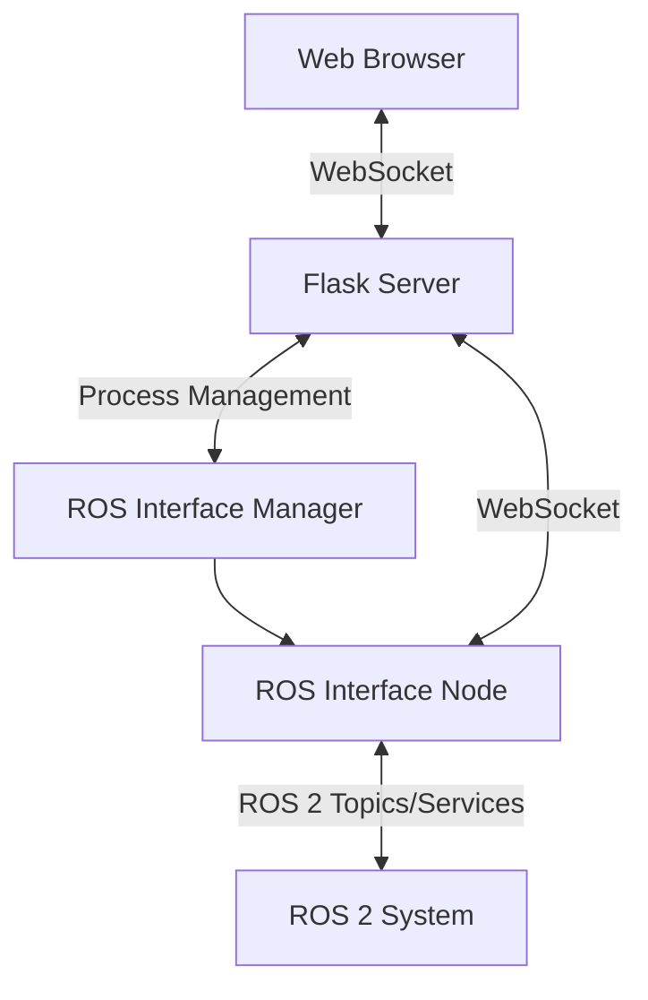
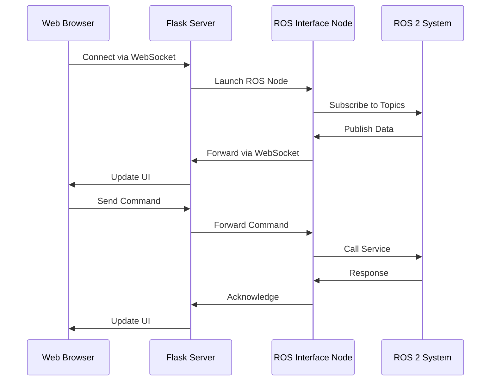

# MVP GUI 2 - Detailed Documentation

## Table of Contents
1. [Introduction](#introduction)
2. [System Architecture](#system-architecture)
3. [Core Components](#core-components)
4. [ROS 2 Integration](#ros-2-integration)
5. [Web Interface](#web-interface)
6. [Communication Flow](#communication-flow)
7. [Configuration System](#configuration-system)
8. [Process Management](#process-management)
9. [Key Features](#key-features)
10. [Usage](#usage)

## Introduction

MVP GUI 2 is a comprehensive web-based graphical user interface designed for monitoring and controlling ROS 2 (Robot Operating System 2) based autonomous vehicles, particularly underwater vehicles. This system provides real-time visualization of vehicle status and enables operators to control various aspects of the vehicle through an intuitive web interface.

The system bridges the gap between complex ROS 2 systems and user-friendly controls, making it easier for operators to monitor vehicle status, control systems, and manage mission parameters without requiring deep knowledge of ROS 2 command-line tools.

## System Architecture

The MVP GUI 2 system follows a three-tier architecture:

```
[Web Browser] ↔ [Flask Web Server] ↔ [ROS 2 Interface Node] ↔ [ROS 2 System]
```

### Architecture Components

1. **Web Frontend**: HTML/CSS/JavaScript interface running in a web browser
2. **Flask Backend**: Python Flask application serving web pages and handling WebSocket connections
3. **ROS 2 Interface Node**: Dedicated ROS 2 node that bridges between web and ROS 2 systems
4. **ROS 2 System**: The actual robotic system with various nodes, topics, and services

### Data Flow Architecture



## Core Components

### 1. Flask Web Application (`run.py`, `mvp_gui/__init__.py`)

The main entry point of the application is `run.py`, which initializes and starts the Flask web server. The Flask application is configured with:

- Flask-SocketIO for real-time communication
- SQLAlchemy for database management
- Jinja2 templating for HTML rendering
- Configuration loading from YAML files

### 2. ROS Interface Node (`mvp_gui/ros_interface.py`)

This is the core component that connects the web interface to the ROS 2 system. It:

- Subscribes to various ROS 2 topics for real-time data
- Provides service clients to call ROS 2 services
- Uses Socket.IO to communicate with the web frontend
- Dynamically configures clients based on ROS parameters

### 3. ROS Interface Manager (`mvp_gui/ros_interface_manager.py`)

Responsible for managing the lifecycle of the ROS interface node:

- Starts the ROS interface node in a separate process
- Manages process lifecycle (start/stop)
- Handles cleanup of previous processes
- Tracks process IDs for proper termination

### 4. Web Routes (`mvp_gui/routes/`)

Organized route handlers for different sections of the application:

- Base routes (`routes_base.py`)
- Map routes (`routes_map.py`)
- Mission routes (`routes_mission.py`)
- Power manager routes (`routes_power_manager.py`)
- Systems routes (`routes_systems.py`)

### 5. Templates and Static Assets (`mvp_gui/templates/`, `mvp_gui/static/`)

- HTML templates using Jinja2
- CSS styling (Bootstrap)
- JavaScript libraries (Socket.IO client, MapLibre GL, Plotly)
- Offline map assets

## ROS 2 Integration

### Topics Subscription

The ROS interface node subscribes to several key topics:

1. **Vehicle Pose**:
   - Odometry (`/odometry`) - Local position and velocity
   - GeoPoseStamped (`/geopose`) - Global position (latitude, longitude, altitude)

2. **Vehicle States**:
   - HelmState (`/helm/state`) - Navigation state machine
   - Bool (`/controller_state`) - Controller status
   - Int16MultiArray (`/gpio_power_state`) - Power system status
   - Int16MultiArray (`/roslaunch_state`) - Launch file status
   - GeoPath (`/survey/geopath`) - Survey path data

### Service Clients

The system provides clients for various services:

1. **State Control**:
   - SetString (`/mvp_helm/change_state`) - Change helm state
   - SetBool (`/controller/set`) - Enable/disable controller

2. **Mission Management**:
   - SendWaypoints (`/mvp_helm/set_waypoints`) - Publish waypoints

3. **System Control**:
   - SetBool (`/gpio_manager/set_power/*`) - Control power systems
   - SetBool (`/roslaunch/*`) - Launch/terminate ROS nodes

### Dynamic Configuration

The system fetches configuration parameters from a C2 commander node:

- GPIO device names
- Launch package names
- Launch file names

These parameters are used to dynamically create service clients for power management and launch control.

## Web Interface

### Pages

The web interface consists of several pages:

1. **Vehicle Status** (`/vehicle_status`): Real-time display of vehicle pose, states, and vitals
2. **Map** (`/map`): Geospatial visualization of vehicle position and mission paths
3. **Mission** (`/mission`): Waypoint management and mission planning
4. **Power Manager** (`/power_manager`): Control of power systems
5. **Systems** (`/systems`): System status and launch file management

### Real-time Updates

The interface uses WebSocket connections for real-time updates:

- Vehicle pose updates (position, orientation, velocity)
- Helm state changes
- Controller state updates
- Power system status
- Launch file status
- Survey path visualization

### User Controls

The interface provides controls for:

- Changing vehicle navigation states
- Enabling/disabling the controller
- Managing power systems
- Publishing waypoints
- Launching/stopping ROS nodes

## Communication Flow

### Startup Sequence

1. Flask application starts (`run.py`)
2. ROS interface manager prepares to launch ROS node
3. User accesses web interface
4. WebSocket connection established
5. ROS interface node launched in separate process
6. ROS node connects to ROS 2 system
7. Real-time data begins flowing to web interface

### Data Flow



### Message Synchronization

For accurate pose visualization, the system uses message_filters to synchronize odometry and geopose messages based on timestamps, ensuring that position and orientation data are properly aligned.

## Configuration System

### Main Configuration (`config/config.yaml`)

The system is configured through a YAML file that defines:

1. **Topic Namespaces**:
   - Base topic namespace (`topic_ns`)
   - Service namespace (`service_ns`)

2. **Topic Mappings**:
   - Pose sources (`poses_source`, `geo_pose_source`)
   - State topics (`helm_state_get`, `controller_state_get`)
   - Power and launch status topics

3. **Service Mappings**:
   - State control services
   - Mission management services
   - System control services

4. **System Configuration**:
   - C2 commander node name
   - Offline map directory

### Dynamic Parameters

Additional configuration is fetched dynamically from the C2 commander node:

- GPIO device names for power management
- Launch package and file names for system control

## Process Management

### ROS Interface Lifecycle

The system manages the ROS interface node as a separate process to:

1. Isolate ROS dependencies from web application
2. Allow independent restart of ROS components
3. Provide better error handling and recovery

### Process Control

The ROS interface manager handles:

1. **Startup**:
   - Cleanup of previous processes
   - Launch via shell script with proper environment
   - PID tracking for management

2. **Shutdown**:
   - Graceful termination of ROS node
   - Cleanup of process and PID files
   - Terminal management

3. **Environment Setup**:
   - ROS workspace sourcing
   - Virtual environment activation
   - Python executable path management

### Launcher Script (`mvp_gui/launch_ros_interface.sh`)

A dedicated shell script handles environment setup:

1. Sources ROS 2 setup files
2. Sources workspace setup if available
3. Activates virtual environment if configured
4. Launches the ROS interface node
5. Manages PID file for process tracking

## Key Features

### Real-time Monitoring

- Continuous vehicle pose updates (position, orientation, velocity)
- Helm state visualization with transition information
- Controller status monitoring
- Power system status with individual device control
- Launch file status monitoring

### Interactive Control

- State machine control for navigation states
- Controller enable/disable functionality
- Individual power system control
- Launch file start/stop capabilities
- Waypoint publishing for mission planning

### Geospatial Visualization

- Map-based vehicle position display
- Survey path visualization
- Offline map support for operation without internet
- Multiple map tile sources

### Mission Planning

- Waypoint management (add, edit, delete)
- Mission path visualization
- Waypoint parameter configuration

### System Management

- Launch file management
- Power system control
- Process lifecycle management
- Configuration flexibility

## Usage

### Prerequisites

1. ROS 2 installation (Jazzy recommended)
2. Python dependencies:
   - Flask
   - Flask-SocketIO
   - Flask-SQLAlchemy
   - Flask-WTF
   - python-socketio
   - PyYAML
   - numpy
3. ROS 2 dependencies:
   - geographic-msgs
   - mvp_msgs

### Installation

1. Clone the repository
2. Install Python dependencies:
   ```bash
   pip install -r requirements.txt
   ```
3. Install ROS 2 dependencies:
   ```bash
   sudo apt install ros-${ROS_DISTRO}-geographic-msgs
   git clone https://github.com/uri-ocean-robotics/mvp_msgs.git
   ```
4. Initialize submodules for offline maps:
   ```bash
   git submodule update --init --recursive
   ```

### Configuration

1. Modify `config/config.yaml` to match your ROS 2 setup
2. Ensure topic and service names match your ROS 2 system
3. Configure the C2 commander node name

### Running the Application

1. Start the main application:
   ```bash
   python run.py
   ```
2. Access the web interface at `http://localhost:5001`
3. The ROS interface node will be automatically launched when needed

### Web Interface Navigation

1. **Vehicle Status**: Real-time vehicle information
2. **Map**: Geospatial visualization
3. **Mission**: Waypoint and mission management
4. **Power Manager**: Power system control
5. **Systems**: System status and launch control

### Control Operations

1. Change vehicle states using the helm state controls
2. Enable/disable the controller as needed
3. Control individual power systems
4. Manage ROS launch files
5. Publish waypoints for navigation missions

This documentation provides a comprehensive overview of the MVP GUI 2 system, its components, and how to use it effectively for monitoring and controlling ROS 2 based autonomous vehicles.