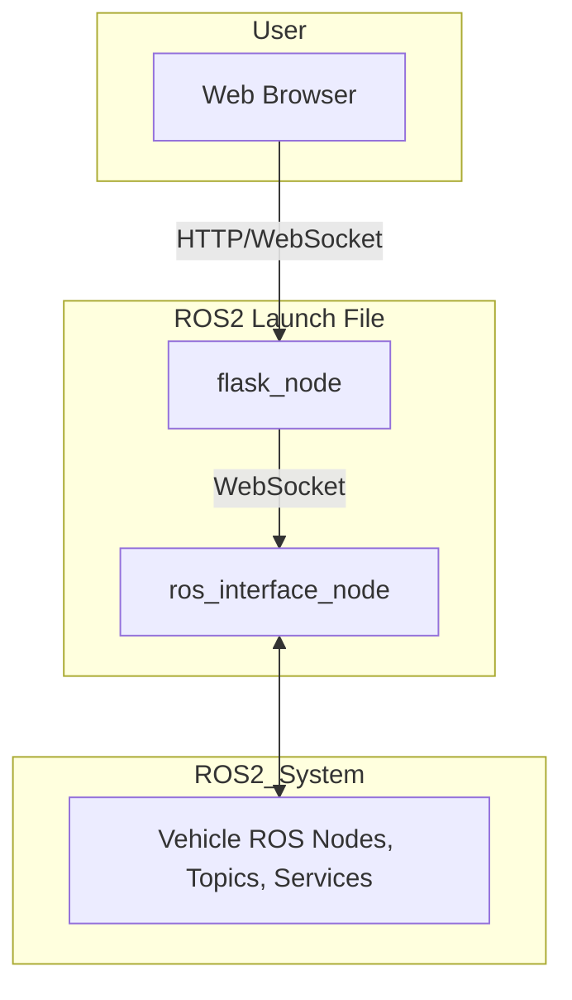
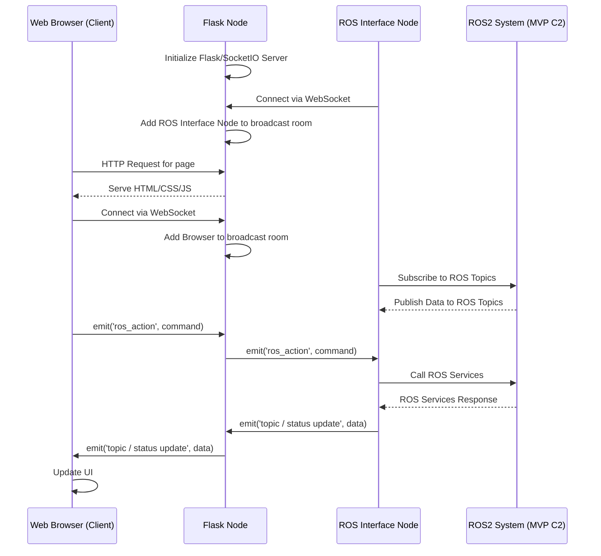

# MVP GUI 2 - Detailed Documentation

## Table of Contents
1. [Introduction](#introduction)
2. [System Architecture](#system-architecture)
3. [Core Components](#core-components)
4. [ROS 2 Integration](#ros-2-integration)
5. [Web Interface](#web-interface)
6. [Communication Flow](#communication-flow)
7. [Configuration System](#configuration-system)
8. [Launch System](#launch-system)
9. [Key Features](#key-features)
10. [Usage](#usage)

## Introduction

MVP GUI 2 is a comprehensive web-based graphical user interface designed for monitoring and controlling ROS 2 (Robot Operating System 2) based autonomous vehicles, particularly underwater vehicles. This system provides real-time visualization of vehicle status and enables operators to control various aspects of the vehicle through an intuitive web interface.

The system is architected as a modern ROS 2 package with decoupled components, bridging the gap between complex ROS 2 systems and user-friendly controls. This makes it easier for operators to monitor vehicle status, control systems, and manage mission parameters without requiring deep knowledge of ROS 2 command-line tools.

## System Architecture

The MVP GUI 2 system is architected as a ROS 2 package containing two primary nodes, managed by a ROS 2 launch file. This decouples the web server from the core ROS interactions, leading to a more robust and scalable system.



### Architecture Components

1.  **Web Frontend**: An HTML/CSS/JavaScript interface running in a standard web browser, providing the user with controls and data visualization.
2.  **Flask Node (`flask_node`)**: A ROS 2 node that runs a Flask web server with Flask-SocketIO. Its responsibilities are:
    *   Serving the web pages (HTML, CSS, JS) to the user's browser.
    *   Managing WebSocket connections from both the browser and the `ros_interface_node`.
    *   Acting as a message broker, relaying data from the `ros_interface_node` to the browser, and commands from the browser to the `ros_interface_node`.
3.  **ROS Interface Node (`ros_interface_node`)**: A dedicated ROS 2 node that acts as the bridge to the vehicle's ROS 2 ecosystem. Its responsibilities are:
    *   Connecting as a WebSocket client to the `flask_node`.
    *   Subscribing to all necessary ROS 2 topics (e.g., pose, state, vitals).
    *   Creating service clients to call ROS 2 services (e.g., changing state, setting power).
    *   Fetching dynamic configuration from other ROS 2 nodes.
    *   Forwarding all received ROS 2 data to the `flask_node` via WebSocket.
    *   Executing actions received from the `flask_node` by calling the appropriate ROS 2 services.
4.  **ROS 2 System**: The underlying robotic system, comprised of various nodes that publish sensor data, manage vehicle state, and expose control services.

## Core Components

### 1. Flask Node (`mvp_gui/nodes/flask_node.py`)

This is a ROS 2 node that acts as the main entry point for the web application. It initializes and starts the Flask web server in a separate thread. The Flask application is configured with:

- Flask-SocketIO for real-time communication.
- SQLAlchemy for database management.
- Jinja2 templating for HTML rendering.
- Configuration loading via ROS 2 parameters from a YAML file.

### 2. ROS Interface Node (`mvp_gui/nodes/ros_interface_node.py`)

This is the core component that connects the web interface to the ROS 2 system. It:

- Subscribes to various ROS 2 topics for real-time data.
- Provides service clients to call ROS 2 services.
- Connects as a WebSocket client to the `flask_node` to send and receive data.
- Dynamically configures its ROS 2 clients based on parameters fetched from other ROS nodes.

### 3. Event Handling (`mvp_gui/events.py`)

This module runs within the Flask application context on the `flask_node`. It defines all the server-side Socket.IO event handlers. It manages a broadcast "room" that includes all connected browser clients and the single `ros_interface_node` client, ensuring messages are relayed between them correctly.

### 4. Application Factory (`mvp_gui/app_factory.py`)

This function is responsible for creating and configuring the Flask application instance. It initializes extensions like SQLAlchemy and SocketIO, registers all the web route blueprints, and sets up the database, ensuring a clean and organized application structure.

### 5. Web Routes (`mvp_gui/routes/`)

Organized route handlers for different sections of the application:

- Base routes (`routes_base.py`)
- Map routes (`routes_map.py`)
- Mission routes (`routes_mission.py`)
- Power manager routes (`routes_power_manager.py`)
- Systems routes (`routes_systems.py`)

### 6. Templates and Static Assets (`mvp_gui/templates/`, `mvp_gui/static/`)

- HTML templates using Jinja2
- CSS styling (Bootstrap)
- JavaScript libraries (Socket.IO client, MapLibre GL, Plotly)
- Offline map assets

## ROS 2 Integration

All direct ROS 2 interactions are handled exclusively by the **`ros_interface_node`**.

### Topics Subscription

The node subscribes to several key topics to gather real-time data:

1.  **Vehicle Pose**:
    - Odometry (`nav_msgs/msg/Odometry`) - Local position and velocity.
    - GeoPoseStamped (`geographic_msgs/msg/GeoPoseStamped`) - Global position (latitude, longitude, altitude).
    - Data from these topics are synchronized using `message_filters` to ensure temporal consistency.

2.  **Vehicle States**:
    - HelmState (`mvp_msgs/msg/HelmState`) - Navigation state machine.
    - Bool (`std_msgs/msg/Bool`) - Controller status.
    - Int16MultiArray (`std_msgs/msg/Int16MultiArray`) - Power system and launch file statuses.
    - GeoPath (`mvp_msgs/msg/Waypoints`) - Survey path data for visualization.

3.  **Vehicle Information**:
    - Float32MultiArray (`std_msgs/msg/Float32MultiArray`) - Power and computer vitals (voltage, current, CPU temp, etc.).

### Service Clients

The node creates clients for various services to send commands to the vehicle:

1.  **State Control**:
    - SetString (`mvp_msgs/srv/SetString`) - To change the helm state.
    - SetBool (`std_srvs/srv/SetBool`) - To enable/disable the controller.

2.  **Mission Management**:
    - SendWaypoints (`mvp_msgs/srv/SendWaypoints`) - To publish a list of waypoints.

3.  **System Control**:
    - SetBool (`std_srvs/srv/SetBool`) - To control individual power systems or launch/terminate ROS nodes.

### Dynamic Configuration

The system is designed to be flexible. The `ros_interface_node` dynamically fetches configuration parameters (e.g., lists of controllable power devices and launch files) from a designated `c2_commander_node` in the ROS 2 system. This allows the GUI to adapt to different vehicle configurations without code changes.

## Web Interface

### Pages

The web interface consists of several pages:

1.  **Systems** (`/`): System status and launch file management.
2.  **Vehicle Status** (`/vehicle_status`): Real-time display of vehicle pose, states, and vitals.
3.  **Power Manager** (`/power_manager`): Control of power systems.
4.  **Mission** (`/mission`): Waypoint management and mission planning.
5.  **Map** (`/map`): Geospatial visualization of vehicle position and mission paths.

### Real-time Updates

The interface uses WebSocket connections for real-time updates:

- Vehicle pose updates (position, orientation, velocity)
- Helm state changes
- Controller state updates
- Power system status
- Launch file status
- Survey path visualization

### User Controls

The interface provides controls for:

- Changing vehicle navigation states
- Enabling/disabling the controller
- Managing power systems
- Publishing waypoints
- Launching/stopping ROS nodes

## Communication Flow

### Startup Sequence

1.  The user executes `ros2 launch mvp_gui_2 mvp_gui_2.launch.py`.
2.  The ROS 2 launch system starts the `flask_node`.
3.  The `flask_node` initializes and starts its embedded Flask/SocketIO web server, making it available on the network.
4.  The launch file waits for a brief period (5 seconds) to ensure the server is ready.
5.  The launch system starts the `ros_interface_node`.
6.  The `ros_interface_node` connects as a WebSocket client to the server hosted by `flask_node`.
7.  A user navigates to the web interface in their browser (e.g., `http://localhost:5001`).
8.  The browser's JavaScript connects to the same WebSocket server. The server places the browser client and the `ros_interface_node` client into a broadcast room.
9.  The `ros_interface_node` subscribes to ROS 2 topics and begins receiving data.
10. Data is sent from the `ros_interface_node` to the browser via the `flask_node`'s WebSocket server, which relays the messages.

### Data Flow



## Configuration System

### Main Configuration (`config/mvp_gui_params.yaml`)

The entire system is configured through a single YAML file that is loaded by the ROS 2 launch system and passed to both nodes. This file defines:

1.  **File Paths**:
    - `tiles_dir`: Path to offline map tile sets.
    - `db_filename`: Name for the SQLite database file.
    - `kml_upload_folder`: Directory for storing uploaded KML files.

2.  **Topic Namespaces & Mappings**:
   - `topic_ns`: Base namespace for all subscribed topics.
   - Specific topic names for pose, state, power, and info sources.

3.  **Service Namespaces & Mappings**:
   - `service_ns`: Base namespace for all service clients.
   - Specific service names for state control, mission management, and system control.

4.  **System Configuration**:
   - `c2_commander_node`: The name of the ROS 2 node from which to fetch dynamic configurations.

### Dynamic Parameters

Additional configuration is fetched at runtime by the `ros_interface_node` from the `c2_commander_node`:

- `gpio_devices`: A list of names for controllable power devices.
- `launch_packages` and `launch_files`: Lists defining the available ROS 2 launch files.

This dynamic fetching allows the GUI to adapt to the specific hardware and software configuration of the robot it is connected to.

## Launch System

The system uses a standard ROS 2 launch file, providing robust and integrated lifecycle management.

### Launch File (`launch/mvp_gui_2.launch.py`)

The primary entry point for running the application is the `mvp_gui_2.launch.py` launch file. It is responsible for:
1.  **Loading Parameters**: It loads the shared configuration from `config/mvp_gui_params.yaml` and passes it to both nodes.
2.  **Launching `flask_node`**: It starts the web server node. `emulate_tty=True` is used to ensure logging output from Flask and SocketIO is visible in the console.
3.  **Launching `ros_interface_node`**: It starts the ROS interface node. A `TimerAction` is used to introduce a 5-second delay before launching this node. This is crucial to give the `flask_node` enough time to start its web server, ensuring the `ros_interface_node` can successfully connect to it on startup.

### Node Architecture

- **`flask_node`**: This node's sole purpose is to run the web application stack. It wraps the Flask server in a ROS 2 node construct but does not directly interact with ROS topics or services. It communicates with the outside world via HTTP and WebSockets.
- **`ros_interface_node`**: This node is a pure ROS 2 application that handles all communication with the robot's systems. It acts as a client to the `flask_node`'s WebSocket server, creating a clean separation of concerns. All ROS-specific logic is contained within this node.

This approach aligns with ROS 2 best practices, where different functionalities are encapsulated in separate nodes, and the launch system orchestrates their startup and configuration.

## Key Features

### Real-time Monitoring

- Continuous vehicle pose updates (position, orientation, velocity)
- Helm state visualization with transition information
- Controller status monitoring
- Power system status with individual device control
- Launch file status monitoring

### Interactive Control

- State machine control for navigation states
- Controller enable/disable functionality
- Individual power system control
- Launch file start/stop capabilities
- Waypoint publishing for mission planning

### Geospatial Visualization

- Map-based vehicle position display
- Survey path visualization
- Offline map support for operation without internet
- Multiple map tile sources

### Mission Planning

- Waypoint management (add, edit, delete from a persistent database)
- Mission path visualization
- Waypoint parameter configuration

### System Management

- Launch file management
- Power system control
- Decoupled node architecture
- Configuration flexibility via YAML and dynamic parameters

## Usage

### Prerequisites

1. ROS 2 installation (tested on Jazzy).
2. System and Python dependencies. These can be installed using `rosdep` or manually. For a manual setup (e.g., on Debian/Ubuntu):
   ```bash
   sudo apt update
   sudo apt install ros-${ROS_DISTRO}-geographic-msgs \
       ros-${ROS_DISTRO}-tf-transformations \
       python3-flask \
       python3-flask-socketio \
       python3-flask-sqlalchemy \
       python3-flask-wtf \
       python3-socketio \
       python3-simple-websocket \
       python-engineio \
       python3-numpy \
       python3-pyyaml
   ```
3. Custom ROS 2 message packages:
   - `mvp_msgs`

### Installation

1.  Clone the repository into your ROS 2 workspace's `src` directory.
2.  Install dependencies:
    - via `rosdep`:
        ```bash
        rosdep install --from-paths src --ignore-src --rosdistro ${ROS_DISTRO} -y
        ```
    - manually:
        ```bash
        sudo apt update
        sudo apt install ros-${ROS_DISTRO}-geographic-msgs \
            ros-${ROS_DISTRO}-tf-transformations \
            python3-flask \
            python3-flask-socketio \
            python3-flask-sqlalchemy \
            python3-flask-wtf \
            python3-socketio \
            python3-simple-websocket \
            python-engineio \
            python3-numpy \
            python3-pyyaml
        ```

3.  Clone required dependency repositories (if not available via `rosdep`), e.g.:
    ```bash
    git clone https://github.com/uri-ocean-robotics/mvp_msgs.git
    ```
4.  Initialize submodules to get offline map data:
    ```bash
    cd /path/to/your/ros2_ws/src/mvp_gui_2
    git submodule update --init --recursive
    ```
5.  Build the workspace:
    ```bash
    colcon build
    ```

### Configuration

1.  Parameters can be set in `config/mvp_gui_params.yaml`
2.  Ensure topic and service names match your ROS 2 system.
3.  Build the workspace

### Running the Application

1.  Source your ROS 2 workspace:
    ```bash
    source /path/to/your/ros2_ws/install/setup.bash
    ```
2.  Launch the application using the ROS 2 launch file:
    ```bash
    ros2 launch mvp_gui_2 mvp_gui_2.launch.py
    ```
3.  Access the web interface in your browser, typically at `http://localhost:5001`.

### Web Interface Navigation

1.  **Systems**: System status and launch control.
2.  **Vehicle Status**: Real-time vehicle information.
3.  **Power Manager**: Power system control.
4.  **Mission**: Waypoint and mission management.
5.  **Map**: Geospatial visualization.

### Control Operations

1.  Change vehicle states using the helm state controls on the Map page.
2.  Enable/disable the controller as needed.
3.  Control individual power systems from the Power Manager page.
4.  Manage ROS launch files from the Systems page.
5.  Publish waypoints for navigation missions from the Map or Mission page.

This documentation provides a comprehensive overview of the MVP GUI 2 system, its components, and how to use it effectively for monitoring and controlling ROS 2 based autonomous vehicles.