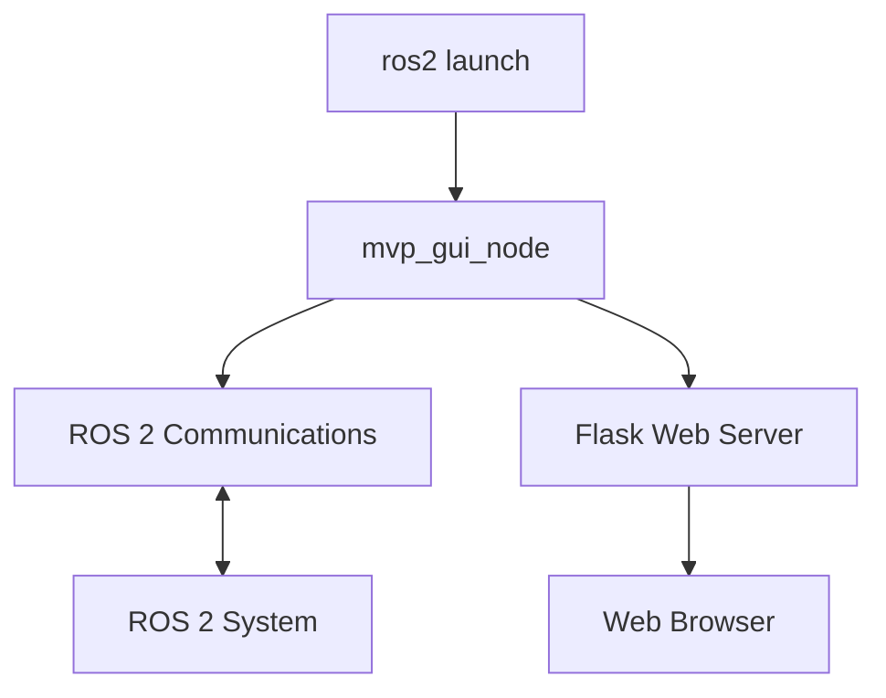

# Converting MVP GUI 2 to a ROS 2 Package

## Overview

This document explains how to convert the MVP GUI 2 application into a proper ROS 2 Python package that can be launched using `ros2 launch`. The conversion involves restructuring the package to follow ROS 2 conventions, creating launch files, and integrating all components into a single launchable system.

## Current Architecture Analysis

The current MVP GUI 2 system has the following components:

1. **Flask Web Server** (`run.py`): Main entry point that starts the web server
2. **ROS Interface Node** (`mvp_gui/ros_interface.py`): Separate ROS 2 node that communicates with the ROS system
3. **ROS Interface Manager** (`mvp_gui/ros_interface_manager.py`): Manages the lifecycle of the ROS interface node
4. **Launcher Script** (`mvp_gui/launch_ros_interface.sh`): Shell script that sets up the environment and launches the ROS node

The current system uses separate processes for the web server and ROS node, connected via Socket.IO.

## Target Architecture

After conversion, the system will have:

1. **Integrated Flask/ROS Node**: A single ROS 2 node that runs both the web server and ROS interface
2. **ROS 2 Launch File**: A launch file that starts all necessary components
3. **Standard ROS 2 Package Structure**: Proper package.xml and setup.py files
4. **No External Scripts**: Elimination of the shell script launcher

## ROS 2 Package Structure Requirements

### Package Files

The package needs the following standard files:

1. **package.xml**: Package manifest with dependencies
2. **setup.py**: Python package setup file
3. **setup.cfg**: Optional configuration file
4. **launch/**: Directory for launch files
5. **resource/<package_name>**: Marker file for ament

### Directory Structure

```
mvp_gui_2/
├── package.xml
├── setup.py
├── setup.cfg
├── resource/
│   └── mvp_gui_2
├── launch/
│   └── mvp_gui_launch.py
├── config/
│   └── config.yaml
├── mvp_gui/
│   ├── __init__.py
│   ├── integrated_node.py  # New integrated node
│   ├── models.py
│   ├── events.py
│   ├── forms.py
│   ├── routes/
│   │   ├── routes_base.py
│   │   ├── routes_map.py
│   │   ├── routes_mission.py
│   │   ├── routes_power_manager.py
│   │   └── routes_systems.py
│   └── templates/
│       └── ... (HTML templates)
└── mvp_gui_offline_map/
    └── ... (map files)
```

## Launch File Implementation

### Launch File Structure

Create `launch/mvp_gui_launch.py`:

```python
from launch import LaunchDescription
from launch_ros.actions import Node
from launch.actions import DeclareLaunchArgument
from launch.substitutions import LaunchConfiguration

def generate_launch_description():
    # Declare launch arguments
    config_file = DeclareLaunchArgument(
        'config_file',
        default_value='',
        description='Path to configuration file'
    )
    
    # Define the integrated MVP GUI node
    mvp_gui_node = Node(
        package='mvp_gui_2',
        executable='mvp_gui_node',
        name='mvp_gui_node',
        output='screen',
        parameters=[{
            'config_file': LaunchConfiguration('config_file')
        }]
    )
    
    # Create launch description
    ld = LaunchDescription()
    
    # Add actions
    ld.add_action(config_file)
    ld.add_action(mvp_gui_node)
    
    return ld
```

## Integrated Flask/ROS Node Architecture

### Node Design

Create `mvp_gui/integrated_node.py` that combines both functionalities:

```python
import rclpy
from rclpy.node import Node
from flask import Flask
from flask_socketio import SocketIO
import threading
import yaml
import os

class IntegratedMVPNode(Node):
    def __init__(self):
        # Initialize ROS node
        super().__init__('mvp_gui_node')
        
        # Initialize Flask app
        self.app = Flask(__name__)
        self.app.config['SECRET_KEY'] = 'abcd1234'
        
        # Initialize SocketIO
        self.socketio = SocketIO(self.app, logger=False, engineio_logger=False)
        
        # Load configuration
        self.load_config()
        
        # Setup ROS communications
        self.setup_ros_communications()
        
        # Setup Flask routes
        self.setup_flask_routes()
        
        # Setup SocketIO handlers
        self.setup_socketio_handlers()
        
        # Start Flask server in a separate thread
        self.flask_thread = threading.Thread(target=self.run_flask_server)
        self.flask_thread.daemon = True
        self.flask_thread.start()
        
    def load_config(self):
        """Load configuration from YAML file"""
        config_path = os.path.join(
            os.path.dirname(__file__), '..', 'config', 'config.yaml')
        with open(config_path, 'r') as file:
            self.config = yaml.safe_load(file)
            
    def setup_ros_communications(self):
        """Setup ROS subscribers, publishers, and service clients"""
        # Move all ROS setup from ros_interface.py here
        pass
        
    def setup_flask_routes(self):
        """Setup Flask routes"""
        # Import and register routes
        from mvp_gui.routes import routes_base, routes_map, routes_mission
        from mvp_gui.routes import routes_power_manager, routes_systems
        
    def setup_socketio_handlers(self):
        """Setup SocketIO event handlers"""
        # Move SocketIO handlers from ros_interface.py here
        pass
        
    def run_flask_server(self):
        """Run Flask server"""
        self.socketio.run(
            self.app, 
            host='0.0.0.0', 
            port=5001, 
            debug=False, 
            use_reloader=False
        )
        
    # Add all ROS callback methods from ros_interface.py here
    # Add all SocketIO handlers from ros_interface.py here

def main(args=None):
    rclpy.init(args=args)
    node = IntegratedMVPNode()
    
    try:
        rclpy.spin(node)
    except KeyboardInterrupt:
        pass
    finally:
        node.destroy_node()
        rclpy.shutdown()

if __name__ == '__main__':
    main()
```

### Modifications to Existing Files

1. **Move ROS callbacks**: Transfer all ROS callback methods from `ros_interface.py` to the integrated node
2. **Move SocketIO handlers**: Transfer all SocketIO event handlers to the integrated node
3. **Update imports**: Modify route files to work with the integrated approach
4. **Remove process management**: Eliminate all code related to subprocess management

## Process Management Changes

### Elimination of External Components

1. **Remove `ros_interface_manager.py`**: No longer needed as everything runs in one process
2. **Remove `launch_ros_interface.sh`**: No longer needed as the node is launched directly by ROS 2
3. **Remove `run.py`**: Replace with a simple node launcher

### New Process Flow



## Configuration Adjustments

### Parameter Handling

Modify the configuration system to work with ROS 2 parameters:

1. **ROS Parameters**: Use ROS 2 parameter system for configuration
2. **YAML Files**: Still use YAML files but load them as ROS parameters
3. **Dynamic Parameters**: Continue to fetch dynamic parameters from C2 commander

### Parameter Loading

In the integrated node:

```python
def load_parameters(self):
    """Load parameters from ROS 2 parameter server"""
    # Declare parameters
    self.declare_parameter('topic_ns', '/default/')
    self.declare_parameter('service_ns', '/default/')
    self.declare_parameter('config_file', '')
    
    # Get parameters
    self.topic_ns = self.get_parameter('topic_ns').value
    self.service_ns = self.get_parameter('service_ns').value
    config_file = self.get_parameter('config_file').value
    
    # Load YAML config if provided
    if config_file:
        with open(config_file, 'r') as file:
            yaml_config = yaml.safe_load(file)
            # Apply configuration
```

## Conversion Steps

### Step 1: Create Package Structure

1. Create `package.xml`:
```xml
<?xml version="1.0"?>
<?xml-model href="http://download.ros.org/schema/package_format3.xsd" schematypens="http://www.w3.org/2001/XMLSchema"?>
<package format="3">
  <name>mvp_gui_2</name>
  <version>1.0.0</version>
  <description>Web-based GUI for ROS 2 based autonomous vehicles</description>
  <maintainer email="maintainer@example.com">Maintainer Name</maintainer>
  <license>Apache License 2.0</license>

  <depend>rclpy</depend>
  <depend>std_msgs</depend>
  <depend>nav_msgs</depend>
  <depend>geographic_msgs</depend>
  <depend>mvp_msgs</depend>
  <depend>std_srvs</depend>
  <depend>rcl_interfaces</depend>

  <exec_depend>ros2launch</exec_depend>

  <export>
    <build_type>ament_python</build_type>
  </export>
</package>
```

2. Create `setup.py`:
```python
from setuptools import setup
from glob import glob
import os

package_name = 'mvp_gui_2'

setup(
    name=package_name,
    version='1.0.0',
    packages=[package_name],
    data_files=[
        ('share/ament_index/resource_index/packages',
            ['resource/' + package_name]),
        ('share/' + package_name, ['package.xml']),
        (os.path.join('share', package_name, 'launch'), glob('launch/*.py')),
        (os.path.join('share', package_name, 'config'), glob('config/*.yaml')),
    ],
    install_requires=[
        'setuptools',
        'flask',
        'flask-socketio',
        'flask-sqlalchemy',
        'flask-wtf',
        'python-socketio',
        'pyyaml',
        'numpy'
    ],
    zip_safe=True,
    maintainer='Maintainer Name',
    maintainer_email='maintainer@example.com',
    description='Web-based GUI for ROS 2 based autonomous vehicles',
    license='Apache License 2.0',
    entry_points={
        'console_scripts': [
            'mvp_gui_node = mvp_gui_2.integrated_node:main',
        ],
    },
)
```

3. Create `setup.cfg`:
```ini
[develop]
script_dir=$base/lib/mvp_gui_2
[install]
install_scripts=$base/lib/mvp_gui_2
```

4. Create `resource/mvp_gui_2` (empty marker file)

### Step 2: Create Launch Directory and File

1. Create `launch/` directory
2. Create `launch/mvp_gui_launch.py` as shown above

### Step 3: Create Integrated Node

1. Create `mvp_gui/integrated_node.py` as shown above
2. Move functionality from `ros_interface.py` to the integrated node
3. Update imports and references

### Step 4: Update Route Files

1. Modify route files to work with the integrated approach
2. Remove any references to external ROS interface

### Step 5: Remove Obsolete Files

1. Remove `run.py`
2. Remove `mvp_gui/ros_interface.py`
3. Remove `mvp_gui/ros_interface_manager.py`
4. Remove `mvp_gui/launch_ros_interface.sh`

### Step 6: Update Configuration Handling

1. Modify configuration loading to use ROS 2 parameters
2. Ensure YAML configuration still works but through ROS parameters

## Benefits of Conversion

### Simplified Deployment

1. **Single Command Launch**: `ros2 launch mvp_gui_2 mvp_gui_launch.py`
2. **Standard ROS 2 Package**: Integrates with ROS 2 ecosystem
3. **Parameter Management**: Uses ROS 2 parameter system
4. **Lifecycle Management**: Managed by ROS 2 launch system

### Improved Integration

1. **Shared Context**: Flask and ROS share the same node context
2. **Simplified Communication**: No need for Socket.IO between processes
3. **Better Error Handling**: Unified error handling and logging
4. **Resource Management**: Better management of system resources

### Enhanced Maintainability

1. **Reduced Complexity**: Fewer moving parts
2. **Standard Structure**: Follows ROS 2 conventions
3. **Easier Debugging**: All components in one process
4. **Better Testing**: Easier to test as a unified system

## Usage After Conversion

### Building the Package

```bash
# Navigate to workspace
cd ~/ros2_ws

# Build the package
colcon build --packages-select mvp_gui_2
```

### Sourcing the Workspace

```bash
source install/setup.bash
```

### Launching the System

```bash
# Launch with default configuration
ros2 launch mvp_gui_2 mvp_gui_launch.py

# Launch with custom configuration
ros2 launch mvp_gui_2 mvp_gui_launch.py config_file:=/path/to/custom/config.yaml
```

### Accessing the Web Interface

After launching, access the web interface at `http://localhost:5001`

## Migration Considerations

### Backward Compatibility

1. **Configuration Files**: Maintain compatibility with existing YAML format
2. **Web Interface**: Keep the same web interface and API
3. **ROS Topics/Services**: Maintain the same topic and service names

### Testing

1. **Unit Tests**: Update unit tests for the integrated approach
2. **Integration Tests**: Test the complete system with ROS 2
3. **Performance Tests**: Verify performance is acceptable with integrated approach

### Deployment

1. **Docker**: Update Docker deployment if used
2. **Systemd**: Update systemd service files if used
3. **Documentation**: Update all documentation to reflect new launch method

This conversion will transform MVP GUI 2 from a hybrid web/ROS system into a fully integrated ROS 2 package that follows standard ROS 2 conventions and can be easily launched and managed using ROS 2 tools.